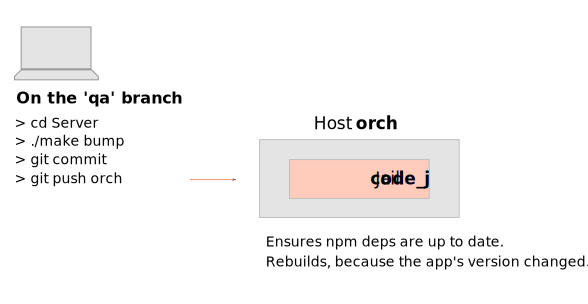

# Build and Deployment

## Quick Reference

```shell script
./make bump
git commit -am "Bump"

git checkout qa
git merge master

git push orch

ssh -t orch_code_j /home/git/deploy
```


## Build
Bump the version (package.json)

`git commit` (make sure it gets to the **qa** branch)

`git push orch` (**qa** branch) this will trigger a production build on the
apps that were bumped. Wait for the build(s) before deploying.


## Deployment
Deploying any SPA implicitly redeploys/reloads the Backend because
their index.html 

`ssh -t orch_code_j /home/git/deploy`
- Select the apps to deploy
- Select the target servers

The Backend deploys to Node, while the other apps to Nginx.

#### First to `qam`
First deploy (and manually test) in `qam` (not hvm).

Clearing Chrome's DNS Cache might
be needed [chrome://net-internals/#dns](chrome://net-internals/#dns)

/etc/hosts
```text
10.0.0.110        example.com
10.0.0.110      blog.example.com

```


## Interaction Example
### Build



### Deployment


## Build Script
The [build script](./jails/code_j/home/git/example.git/hooks/post-receive)
lives in `orch_code_j`, and it's a post-receive hook that:
- If any dependency changed in package-lock.json, runs
	- `npm ci` (deletes node_modules and installs them).
- If the app's version changed, runs
	- `./make prod`

## Deployment Script
The [main deployment script](./jails/code_j/home/git/deploy)
also lives in `orch_code_j`, and does two things:

1. Sends production bundles to `/home/deployer/$app` of the location
	 jails (`node_j` or `nginx_j`). Let's call these directories "collectors",
	 to distinguish them from the actual "serving root" directories.

2. Triggers the app-specific deployment script(s). The next two
	 sections explain them in detail. But in summary, they copy from the
	 collector directory, over to the serving directory, then reload.

Old hash-named assets are kept servable to avoid rare but potential
404's. For that, `rsync` doesn't use any delete file flag.


## Nginx's Deployment Scripts [(Example)](../location-server/jails/nginx_j/home/deployer/deploy-UserDocs)
These serving directories are `/usr/local/DistBundles/$app}`.
And are created by [nginx_j/setup.sh](../location-server/jails/nginx_j/setup.sh).

This script is triggered by `orch_code_j` via SSH command. It:
- rsyncs
- Reloads Nginx


## [Node's Deployment Script](../location-server/jails/node_j/home/deployer/deploy-Server)
- rsyncs `/usr/local/DistBundles/Server`
- Reloads Node


